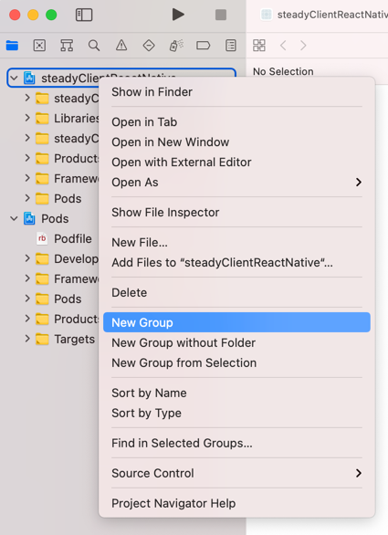
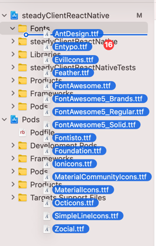
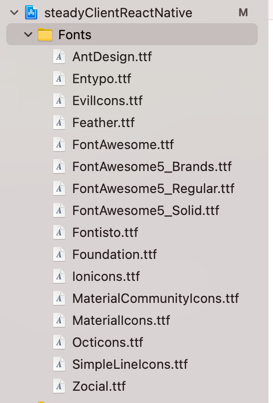

# ReactNative

```shell
brew install node
brew install whatchman
sudo gem install cocoapods

npx react-native init {TestProject}
cd {TestProject}
npx react-native start
[Keep on this terminal]

[new Terminal] 
npx react-native run-ios
```


## react-native-vector-icons
```shell
npm i -save react-native-vector-icons
```

### IOS
```shell
open ios/{TestProject}.xcworkspace
```


그룹 이름을 'Fonts'로 지정


1. node_modules/react-native-vector-icons/Fonts의 모든 폰트를 드래그
2. `Copy items if needed` 체크
3. Finish



ios/{TestProject}/info.plist에 아래 내용 추가
```shell
<key>UIAppFonts</key>
  <array>
    <string>AntDesign.ttf</string>
    <string>Entypo.ttf</string>
    <string>EvilIcons.ttf</string>
    <string>Feather.ttf</string>
    <string>FontAwesome.ttf</string>
    ...
  </array>
```

xcode에서 아래 메뉴 실행

`Product -> Clean Build Folder`(Cmd + Shift + K)
`Project -> Build`(Cmd + B)

pod install
```shell
cd ios
pod install
cd ..
```


### Android

android/app/build.gradle 파일 맨 마지막에 추가
```shell
apply from: file("../../node_modules/react-native-vector-icons/fonts.gradle")
```

```shell
mkdir -p android/app/src/main/assets/fonts

cp node_modules/react-native-vector-icons/Fonts/* android/app/src/main/assets/fonts/ 

open -a /Applications/Android\\ Studio.app ./android
```
android/app/build.gradle 에 추가
```shell
project.ext.vectoricons = [
    iconFontName: [
        'FontAwesome.ttf',
        'AntDesign.ttf',
        'Entypo.ttf',
        'EvilIcons.ttf',
        'Feather.ttf',
        'FontAwesome5_Brands.ttf',
        'FontAwesome5_Regular.ttf',
        'FontAwesome5_Solid.ttf',
        'Fontisto.ttf',
        'Foundation.ttf',
        'Ionicons.ttf',
        'MaterialCommunityIcons.ttf',
        'MaterialIcons.ttf',
        'Octicons.ttf',
        'SimpleLineIcons.ttf',
        'Zocial.ttf'
    ]
]

apply from: file("../../node_modules/react-native-vector-icons/fonts.gradle")
```

android/settings.gradle
```shell
include ':react-native-vector-icons'
project(':react-native-vector-icons').projectDir = new File(rootProject.projectDir, '../nodemodules/react-native-vector-icons/android')
```

android/app/build.gradle
```shell
implementation project(':react-native-vector-icons')
```
